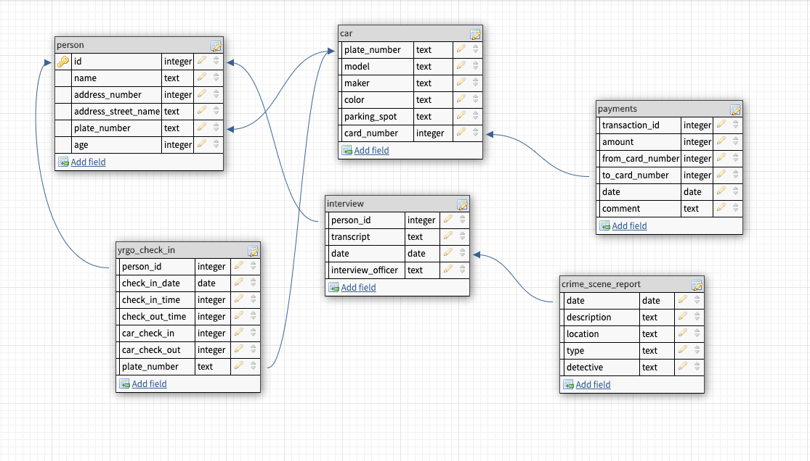

# Making-a-murder
Assignment in SQL 

## The story
There's been a crime! It is up to you to solve it. 
The detectives Daniel and Ida seems to have lost their notes but managed to create a database for you to look into. 
They remember it was a cybercrime and the location was at Yrgo. The date of the crime took place 20201022. 

## Screenshot of database structure

## Creators
* <a href="https://github.com/Fvrom/">Ida From</a>
* <a href="https://github.com/danielmedb">Daniel Borgström<a href="">

